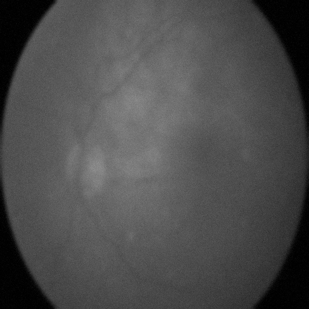
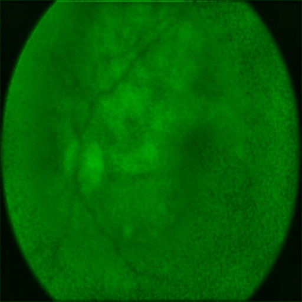
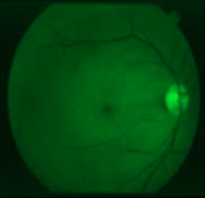
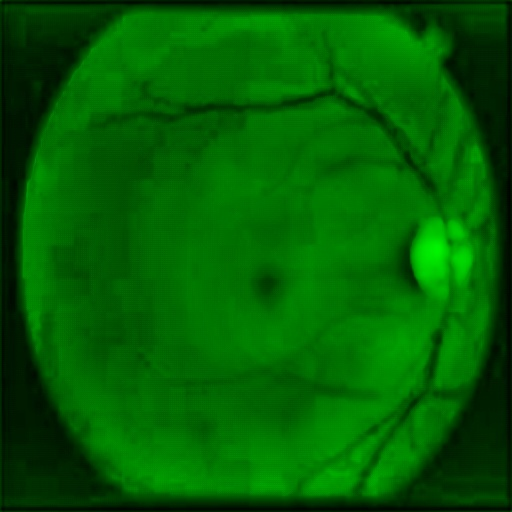
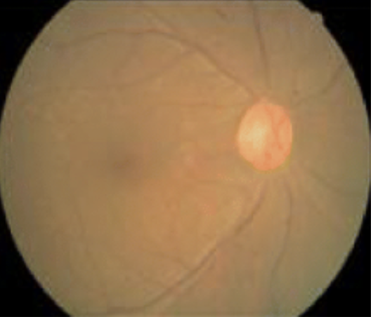
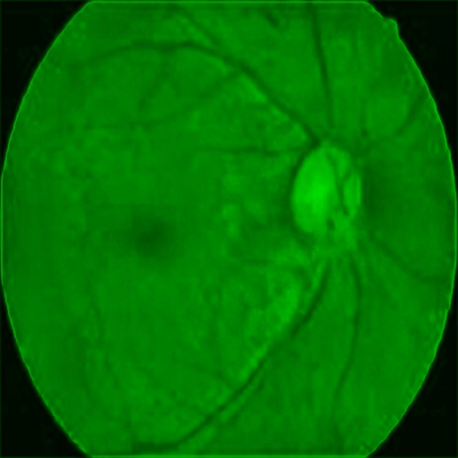

# ML-based Adaptive Optics for Deblurring Retinae
An end-to-end deep learning project exploring blind image deconvolution for retinal imaging using a U-Net architecture enhanced with a model function tailored to retinal anatomical features. Here we investigate whether a convolutional neural network can reconstruct retinal features from blurred fundus images.

<h3 align="center">Deconvolution Results (Before vs After)</h3>

<table align="center">
  <!-- Columns Headers -->
  <thead>
    <tr>
      <th width="50%">Input Image</th>
      <th width="50%">Deblurred Output</th>
    </tr>
  </thead>
  <tbody>
    <!-- Row 1: Sample Case 01 -->
    <tr>
      <td></td>
      <td></td>
    </tr>
    <!-- Row 2: Sample Case 02 -->
    <tr>
      <td></td>
      <td></td>
    </tr>
    <!-- Row 3: Sample Case 03 -->
    <tr>
      <td></td>
      <td></td>
    </tr>
  </tbody>
</table>

## Background
Retinal images can be blurry due to factors like camera focus, ocular aberrations, and imaging limitations. Improper image quality can reduce diagnostic accuracy and causes inconveniences. This project explores whether deep learning can automatically recover sharp retinal images from blurred observations.

## Objective
The current implementation evaluates reconstruction from synthetically blurred retinal images. Performance on real-world optical and motion blur is a valid question; my project can reconstruct the quality of retinal images irrespective of the source of blur.

## Operation Procedure / Methodology
Although the underlying blur kernel is unknown, the network is trained in a supervised image-to-image framework using paired sharp and synthetically blurred images. At inference time, the blur kernel does not need to be explicitly estimated. The full stack application processes input images such that the output images are strictly greenscale; the color selection is intentional, and is the color channel used by doctors to accurately examine retinal images.

## Model Architecture

U-Net – encoder → bottleneck → decoder → skip connections

Loss functions: Anatomical Priority Loss --> combines anatomical feature extraction with a localized 2D Laplacian convolution filter

Evaluation metrics: SSIM, PSNR

Post-processing: Applied localized Contrast-Limited Adaptive Histogram Equalization (CLAHE) to enhance local contrast and improve the visibility of retinal blood vessels

Training was configured with a batch size of 4 and 250 batches per epoch, resulting in 1,000 training samples being processed per epoch. After three epochs, the model demonstrated substantial visual recovery of retinal vascular structures in the evaluation samples. Additional training produced diminishing visual improvements in my experiments, so training was stopped at this point.

Optimizer: Adam
Learning rate: 1e-4 (0.0001)
Framework: PyTorch
Hardware: Apple Silicon GPU (MPS Acceleration)

## Workflow / Pipeline
1. Fundus Image
2. Greenscale, resized to 512x512, synthetic Gaussian blurring added via 15x15 kernel
3. Model trained on deblurring synthetically blurred images via U-Net architecture
4. Loss function is custom, prioritizes retina anatomy, enhanced with 2D Laplacian filter
5. Web interface for uploading any retinal image (greenscale, grayscale, RGB, etc.)
6. Input image converted to greenscale before deblurring; post-processing handled by CLAHE*
8. Blurred image restored in greenscale

*CLAHE --> Contrast Limited Adaptive Histogram Equalization

## Core Logic
We have y = k*x + n, where x is the ground truth (original image), y is the observed blurred image, k is the point spread function, and n is noise. We are given y, and we must derive x.

## Data Specifications
The Kaggle dataset used for this project is 22 GB and is excluded via the .gitignore to maintain a lightweight and fast codebase.
The name of the dataset is "Eyepacs, Aptos, Messidor Diabetic Retinopathy" and it was created by Abdullah S. Canipek et al. under the username ascanipek.

## Usage
To run this project locally, use the following command to download the dataset onto your computer's local terminal:

kaggle datasets download -d ascanipek/eyepacs-aptos-messidor-diabetic-retinopathy -p data/raw

This downloads the data as a zipfile. To unzip it, run:

unzip data/raw/eyepacs-aptos-messidor-diabetic-retinopathy.zip -d data/raw/extracted_images

## Repository Structure
DeepAO_for_blurry_retinae/
├── data/
│   ├── raw/
│   ├── processed/
│   └── web_uploads/
├── models/
│   └── unet_anatomical_sliding_epoch_3.pth
├── src/
│   ├── simulator.py
│   ├── model.py
│   ├── data_loader.py
│   ├── train.py
│   └── evaluate.py
├── templates/
│   └── index.html
├── app.py
└── README.md
